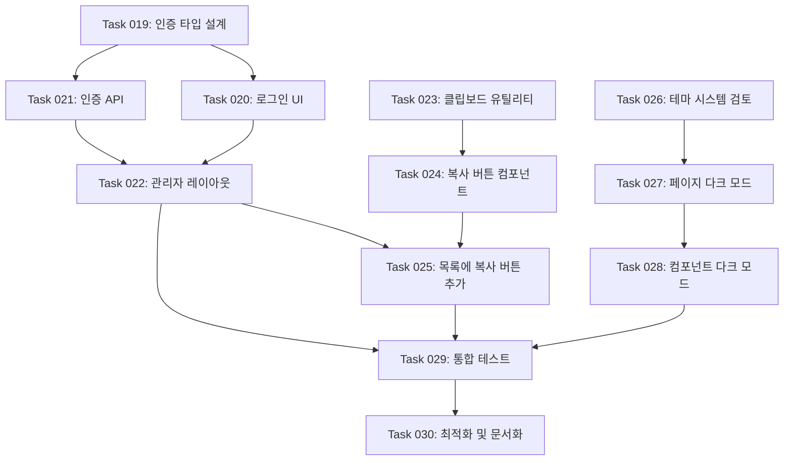

# Notion Invoice Manager 고도화 개발 로드맵

Notion 기반 인보이스 관리 시스템의 관리자 인증, 공유 링크 복사, 다크 모드 고도화 작업

## 개요

Notion Invoice Manager는 프리랜서, 소규모 사업자 및 그들의 클라이언트를 위한 인보이스 관리 시스템으로 다음 고도화 기능을 제공합니다:

- **관리자 인증 시스템**: 관리자만 인보이스 목록에 접근 가능한 보안 기능
- **공유 링크 복사 기능**: 클라이언트에게 인보이스 링크를 쉽게 공유할 수 있는 기능
- **다크 모드 지원**: 전체 애플리케이션에 일관된 다크 모드 테마 적용

## 개발 워크플로우

> 생성된 ROADMAP.md를 사용하는 개발팀의 실제 작업 프로세스

1. **작업 계획**

- 기존 코드베이스를 학습하고 현재 상태를 파악
- 새로운 작업을 포함하도록 `ROADMAP.md` 업데이트
- 우선순위 작업은 마지막 완료된 작업 다음에 삽입

2. **작업 생성**

- 고수준 명세서, 관련 파일, 수락 기준, 구현 단계 포함
- **API/비즈니스 로직 작업 시 "## 테스트 체크리스트" 섹션 필수 포함 (Playwright MCP 테스트 시나리오 작성)**

3. **작업 구현**

- 작업 파일의 명세서를 따름
- 기능과 기능성 구현
- **API 연동 및 비즈니스 로직 구현 시 Playwright MCP로 테스트 수행 필수**
- 각 단계 후 작업 파일 내 단계 진행 상황 업데이트
- 구현 완료 후 Playwright MCP를 사용한 E2E 테스트 실행
- 테스트 통과 확인 후 다음 단계로 진행
- 각 단계 완료 후 중단하고 추가 지시를 기다림

4. **로드맵 업데이트**

- 로드맵에서 완료된 작업을 완료 표시로 갱신

## 개발 단계

### Phase 1: 관리자 인증 시스템 구축

- **Task 019: 관리자 인증 타입 및 유틸리티 설계** - 우선순위
  - 인증 관련 TypeScript 타입 정의 (`types/auth.ts`)
  - 세션 및 사용자 인터페이스 정의
  - 환경 변수 타입 확장 (`lib/env.ts`)
  - 인증 상태 관리를 위한 컨텍스트 인터페이스 설계

- **Task 020: 관리자 로그인 UI 구현**
  - 로그인 페이지 레이아웃 및 라우트 생성 (`app/(auth)/login/page.tsx`)
  - 로그인 폼 컴포넌트 구현 (React Hook Form + Zod 검증)
  - 로그인 실패/성공 피드백 UI 구현
  - 로딩 상태 및 에러 메시지 표시

- **Task 021: 인증 API 및 미들웨어 구현**
  - 로그인 API 엔드포인트 구현 (`app/api/auth/login/route.ts`)
  - 로그아웃 API 엔드포인트 구현 (`app/api/auth/logout/route.ts`)
  - 세션 검증 API 구현 (`app/api/auth/session/route.ts`)
  - 쿠키 기반 세션 관리 유틸리티
  - 환경 변수 기반 관리자 자격 증명 검증
  - ## 테스트 체크리스트
    - 올바른 자격 증명으로 로그인 성공 확인
    - 잘못된 자격 증명으로 로그인 실패 확인
    - 로그아웃 후 세션 무효화 확인
    - 만료된 세션 처리 확인

- **Task 022: 관리자 전용 레이아웃 및 라우트 보호**
  - 관리자 전용 레이아웃 생성 (`app/(admin)/layout.tsx`)
  - 인보이스 목록 페이지를 관리자 영역으로 이동 (`app/(admin)/invoices/page.tsx`)
  - 미인증 사용자 리다이렉션 로직 구현
  - 관리자 헤더에 로그아웃 버튼 추가
  - 인증 상태에 따른 네비게이션 메뉴 조건부 렌더링
  - ## 테스트 체크리스트
    - 미인증 사용자가 관리자 페이지 접근 시 로그인 페이지로 리다이렉션
    - 인증된 사용자가 관리자 페이지 정상 접근
    - 로그아웃 후 관리자 페이지 접근 불가 확인

---

### Phase 2: 공유 링크 복사 기능 구현

- **Task 023: 클립보드 복사 유틸리티 구현**
  - 클립보드 API 래퍼 함수 구현 (`lib/clipboard.ts`)
  - 브라우저 호환성 처리 (Clipboard API 미지원 시 폴백)
  - 복사 성공/실패 상태 반환 타입 정의

- **Task 024: 공유 링크 복사 버튼 컴포넌트 구현**
  - 공유 링크 복사 버튼 컴포넌트 생성 (`components/copy-link-button.tsx`)
  - 복사 완료 피드백 UI (툴팁 또는 토스트 메시지)
  - 복사 중 로딩 상태 표시
  - 접근성 지원 (aria-label, 키보드 지원)

- **Task 025: 인보이스 목록에 공유 링크 열 추가**
  - 인보이스 테이블에 공유 링크 복사 버튼 열 추가 (`components/invoice-table.tsx`)
  - 공유 링크 URL 생성 로직 (`/invoices/[id]` 형식)
  - 복사 성공 시 시각적 피드백 (아이콘 변경 또는 색상 변경)
  - ## 테스트 체크리스트
    - 복사 버튼 클릭 시 올바른 URL이 클립보드에 복사됨
    - 복사 성공 후 피드백 메시지 표시
    - 복사된 링크로 인보이스 상세 페이지 접근 가능

---

### Phase 3: 다크 모드 기능 완성

- **Task 026: 다크 모드 테마 시스템 검토 및 개선**
  - 현재 next-themes 설정 검토 및 최적화
  - CSS 변수 기반 테마 색상 체계 정의 확인
  - 다크 모드 전환 시 깜빡임 방지 처리
  - 시스템 테마 자동 감지 동작 확인

- **Task 027: 핵심 페이지 다크 모드 스타일 적용**
  - 홈 페이지 다크 모드 스타일 적용 및 검증
  - 인보이스 목록 페이지 다크 모드 스타일 적용
  - 인보이스 상세 페이지 다크 모드 스타일 적용
  - 로그인 페이지 다크 모드 스타일 적용

- **Task 028: 공통 컴포넌트 다크 모드 일관성 검토**
  - Header 컴포넌트 다크 모드 스타일 검증
  - Footer 컴포넌트 다크 모드 스타일 검증
  - 인보이스 테이블 다크 모드 스타일 개선
  - 폼 컴포넌트 다크 모드 스타일 검증
  - PDF 다운로드 버튼 등 액션 버튼 스타일 검증
  - ## 테스트 체크리스트
    - 라이트/다크/시스템 모드 전환 정상 동작
    - 모든 페이지에서 텍스트 가독성 확보
    - 테마 전환 시 깜빡임 없음
    - 브라우저 새로고침 후 테마 설정 유지

---

### Phase 4: 통합 테스트 및 최적화

- **Task 029: 전체 사용자 플로우 통합 테스트**
  - Playwright MCP를 사용한 관리자 로그인 플로우 테스트
  - 인보이스 목록 조회 및 공유 링크 복사 플로우 테스트
  - 클라이언트 공유 링크 접근 플로우 테스트
  - 다크 모드 전환 플로우 테스트
  - 에러 핸들링 및 엣지 케이스 테스트
  - ## 테스트 체크리스트
    - 관리자: 로그인 -> 인보이스 목록 -> 링크 복사 -> 로그아웃 전체 플로우
    - 클라이언트: 공유 링크 접근 -> 인보이스 확인 -> PDF 다운로드 플로우
    - 미인증 사용자 보호된 페이지 접근 시도 -> 리다이렉션 확인
    - 다크/라이트 모드 전환 및 페이지 이동 시 테마 유지

- **Task 030: 성능 최적화 및 문서화**
  - 인증 상태 체크 최적화 (불필요한 API 호출 최소화)
  - 클라이언트 사이드 상태 관리 최적화
  - README.md에 관리자 인증 설정 가이드 추가
  - 환경 변수 설정 문서 업데이트

---

## 기술적 의존성 관계



---

## 기능 추적 매트릭스

| 기능 ID | 기능명 | 관련 Task | 상태 |
|---------|--------|-----------|------|
| **F005** | 관리자 인증 시스템 | Task 019, 020, 021, 022 | 대기 |
| **F006** | 공유 링크 복사 | Task 023, 024, 025 | 대기 |
| **F007** | 다크 모드 완성 | Task 026, 027, 028 | 대기 |

---

## 성공 지표 추적

### 기능 완성도
- [ ] 관리자 로그인 성공률 100%
- [ ] 공유 링크 복사 성공률 100%
- [ ] 다크 모드 전환 시 깜빡임 0건

### 사용자 경험
- [ ] 로그인 응답 시간 < 1초
- [ ] 클립보드 복사 피드백 즉시 표시
- [ ] 테마 전환 즉시 반영

### 보안 지표
- [ ] 미인증 사용자 관리자 페이지 접근 차단 100%
- [ ] 세션 만료 후 자동 로그아웃 동작
- [ ] 클라이언트는 공유 링크로만 개별 인보이스 접근 가능

---

## 기술 스택 요약

| 카테고리 | 기술 |
|----------|------|
| 프레임워크 | Next.js 16.1 (App Router), React 19.2 |
| 언어 | TypeScript 5.x |
| 스타일링 | TailwindCSS v4, shadcn/ui |
| 폼/검증 | React Hook Form 7.x, Zod 4.x |
| 테마 | next-themes |
| 외부 API | @notionhq/client (Notion API v1) |
| PDF 생성 | react-pdf/renderer |
| 배포 | Vercel |

---

## 환경 변수 추가 사항

```env
# 기존 환경 변수
NOTION_API_KEY=secret_xxxxxxxxxxxxxxxxxxxxxxxxxxxxxxxxxxxxxxxx
NOTION_DATABASE_ID=xxxxxxxxxxxxxxxxxxxxxxxxxxxxxxxx
NEXT_PUBLIC_BASE_URL=http://localhost:3000

# 관리자 인증 (신규)
ADMIN_USERNAME=admin
ADMIN_PASSWORD=your_secure_password
SESSION_SECRET=your_session_secret_key
```

---

**문서 버전**: 2.0 (고도화)
**최종 수정일**: 2025-12-29
**기반 PRD**: notion-prd.md v2.0
**이전 로드맵**: ROADMAP_V1.md (MVP 완료)
